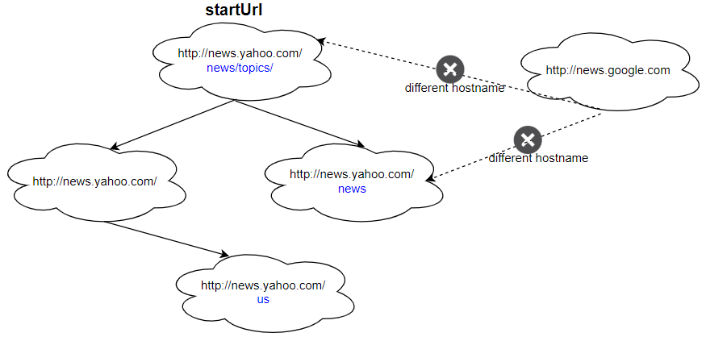
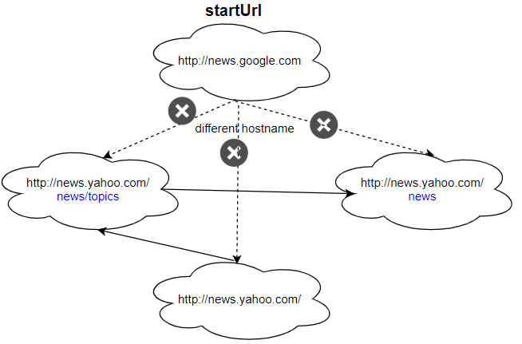

## 1242. 多线程网页爬虫

给你一个初始地址 `startUrl` 和一个 HTML 解析器接口 `HtmlParser`，请你实现一个 **多线程的网页爬虫**，用于获取与 `startUrl` 有 相同主机名 的所有链接。

以 任意 顺序返回爬虫获取的路径。

爬虫应该遵循：
```
    从 startUrl 开始
    调用 HtmlParser.getUrls(url) 从指定网页路径获得的所有路径。
    不要抓取相同的链接两次。
    仅浏览与 startUrl 相同主机名 的链接。
```


如上图所示，主机名是 `example.org` 。简单起见，你可以假设所有链接都采用 `http` 协议，并且没有指定 `端口号`。举个例子，链接 `http://leetcode.com/problems` 和链接 `http://leetcode.com/contest` 属于同一个 主机名， 而 `http://example.org/test` 与 `http://example.com/abc` 并不属于同一个 主机名。

`HtmlParser`的接口定义如下：
```java
interface HtmlParser {
  // Return a list of all urls from a webpage of given url.
  // This is a blocking call, that means it will do HTTP request and return when this request is finished.
  public List<String> getUrls(String url);
}
```
注意一点，`getUrls(String url)` 模拟执行一个HTTP的请求。 你可以将它当做一个阻塞式的方法，直到请求结束。 `getUrls(String url)` 保证会在 15ms 内返回所有的路径。 单线程的方案会超过时间限制，你能用多线程方案做的更好吗？

对于问题所需的功能，下面提供了两个例子。为了方便自定义测试，你可以声明三个变量 `urls`，`edges` 和 `startUrl`。但要注意你只能在代码中访问 `startUrl`，并不能直接访问 `urls` 和 `edges`。


拓展问题：
```
    1.假设我们要要抓取 10000 个节点和 10 亿个路径。并且在每个节点部署相同的的软件。软件可以发现所有的节点。我们必须尽可能减少机器之间的通讯，并确保每个节点负载均衡。你将如何设计这个网页爬虫？
    2.如果有一个节点发生故障不工作该怎么办？
    3.如何确认爬虫任务已经完成？
```


示例 1：

```
输入：
urls = [
  "http://news.yahoo.com",
  "http://news.yahoo.com/news",
  "http://news.yahoo.com/news/topics/",
  "http://news.google.com",
  "http://news.yahoo.com/us"
]
edges = [[2,0],[2,1],[3,2],[3,1],[0,4]]
startUrl = "http://news.yahoo.com/news/topics/"
输出：[
  "http://news.yahoo.com",
  "http://news.yahoo.com/news",
  "http://news.yahoo.com/news/topics/",
  "http://news.yahoo.com/us"
]
```

示例 2：

```
输入：
urls = [
  "http://news.yahoo.com",
  "http://news.yahoo.com/news",
  "http://news.yahoo.com/news/topics/",
  "http://news.google.com"
]
edges = [[0,2],[2,1],[3,2],[3,1],[3,0]]
startUrl = "http://news.google.com"
输出：["http://news.google.com"]
解释：startUrl 链接与其他页面不共享一个主机名。
```


提示：

* `1 <= urls.length <= 1000`
* `1 <= urls[i].length <= 300`
* `startUrl` 是 urls 中的一个。
* 主机名的长度必须为 1 到 63 个字符（包括点 . 在内），只能包含从 “a” 到 “z” 的 `ASCII` 字母和 “0” 到 “9” 的数字，以及中划线 “-”。
* 参考资料：https://en.wikipedia.org/wiki/Hostname#Restrictions_on_valid_hostnames
* 你可以假设路径都是不重复的。

来源：力扣（LeetCode）
链接：https://leetcode-cn.com/problems/web-crawler-multithreaded
著作权归领扣网络所有。商业转载请联系官方授权，非商业转载请注明出处。

## 解题思路
解题思路:
* 使用 ConcurrentHashMap 存储答案 （ConcurrentHashSet 力扣上该题好像不能用）
* 使用 LinkedBlockingQueue 存储准备解析的 URL，初始包含 startUrl, 解析过程中会动态添加、和弹出
* 准备若干个线程，每个线程都从 非空的 LinkedBlockingQueue 弹出一个 url，进行解析
  * 如果答案中没有，并且满足相同主机名要求，则加入答案，并增加到 LinkedBlockingQueue 中 （依照题意“ 你可以假设路径都是不重复的”，这里没有考虑重复解析的情况）
  * 如果 LinkedBlockingQueue 空了，判断一下其他线程是不是也没有在工作了，如果是，中断其他线程，然后结束自己
* 外层阻塞等待线程结束
* 返回答案
