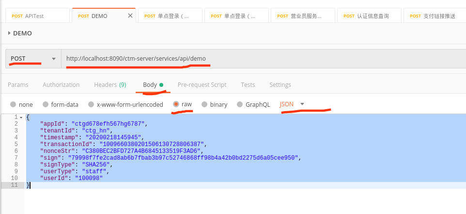

### API 开发指南
#### 正向API（？ -> 本平台）
- (1) 请求类 继承 `ApiRequest`, 响应类 继承 `ExtendApiResponse`
- (2) 编写业务执行类 `ApiInvoker`
- (3) 使用 `ApiProxy`

##### DEMO
- `Controller` 方式（仅限单点登录）
    `ApiTestController` 的`test`方法，对应 http://localhost:8090/ctm/apiTest/
- `CXF`（其他不需要会话的接口）
    `HttpApiService` 的 `demo` 方法，对应   `http://localhost:8090/services/api/demo

示例请求报文：
```json
{
    "appId": "ctgd678efh567hg6787",
    "tenantId": "ctg_hn",
    "timestamp": "202002181459",
    "transactionId": "1009660380201506130728806387",
    "nonceStr": "C380BEC2BFD727A4B6845133519F3AD6",
    "sign": "7e139ffa4ad62be0b46b3deae6577ffa258f4126d9b444b6e1e77481ab285f41",
    "signType": "SHA256",
    "userType": "staff",
    "userId": "100098"
  }
```

#### 反向API（ 本平台 -> ？）:
- (1) 请求类 继承 `ExtendReverseApiRequest`, 响应类 继承 `ReverseApiResponse`
- (2) 调用对端的 `URL` 配置在 表`ctm_api_inst` 中
- (3) 使用 `ApiNotify`

##### DEMO
 - (1)`ApiTestController` 的 `testNotify` 方法，对应   http://localhost:8090/apiTest/notify

    模拟对端的URL:  `mock` 方法，http://localhost:8090/apiTest/mock
> 注意：这里是模拟调用，一般反向代码写到 `inf` 模块中。

#### 测试工具 POSTMAN



